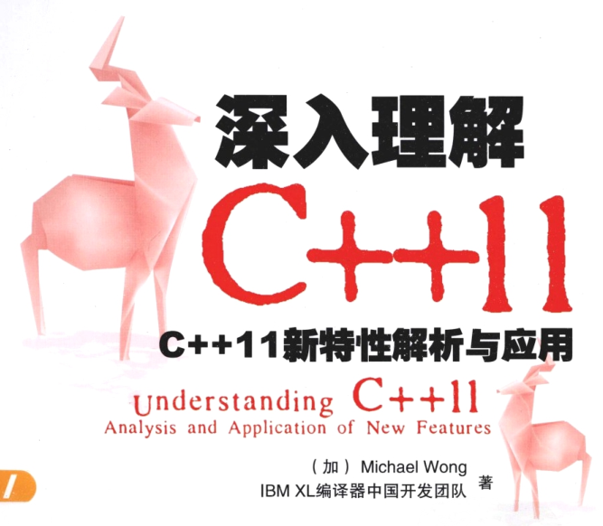

# C++11

学习这本书过程中做的笔记

## 一、笔记目录

+ 001：保证稳定性和兼容性
+ 002：通用为本，专用为末
+ 003：新手易学，老兵易用
+ 004：提高类型安全
+ 005：提高性能及操作硬件的能力
+ 006：为改变思考方式而改变
+ 007：融入实际应用

## 二、C++11语言变化的领域

C++11相对于C++98/03有哪些显著的增强呢？

+ 通过内存模型、线程、原子操作等来支持本地并行编程（Native Concurrency）。
+ 通过统一初始化表达式、auto、declytype、移动语义等来统一对泛型编程的支持。
+ 通过constexpr、POD（概念）等更好地支持系统编程。
+ 通过内联命名空间、继承构造函数和右值引用等，以更好地支持库的构建。